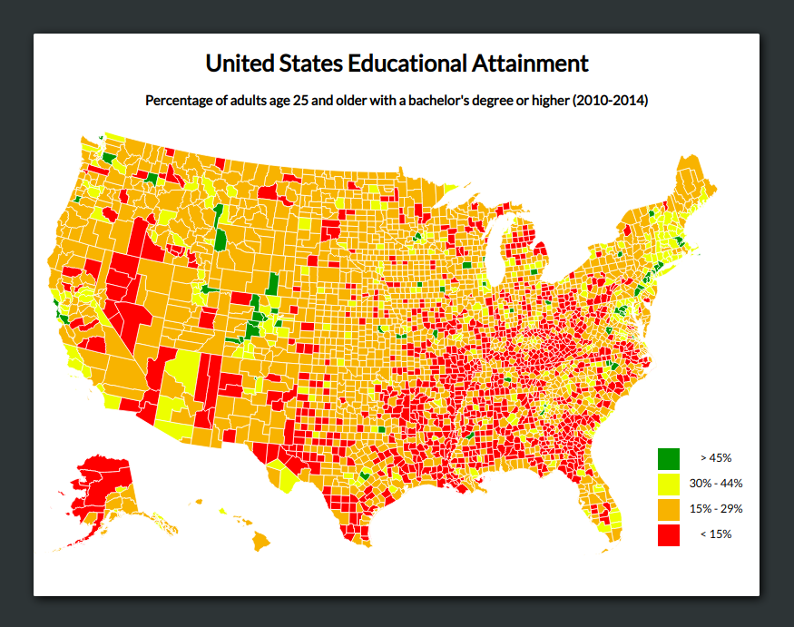

# Choropleth Map

## Introduction
This choropleth map displays the percentage of the population with a Bachelors degree or higher for each county on the United States of America. Different colors represent the different data levels and give a quick indication of the education levels over the whole country.

This project is part of freeCodeCamps Data Visualization certificate.

## Project Requirements
* The choropleth should have a title with a corresponding id="title".
* The choropleth should have a description element with a corresponding id="description".
* The choropleth should have counties with a corresponding class="county" that represent the data.
* There should be at least 4 different fill colors used for the counties.
* The counties should each have data-fips and data-education properties containing their corresponding fips and education values.
* The choropleth should have a county for each provided data point.
* The counties should have data-fips and data-education values that match the sample data.
* The choropleth should have a legend with a corresponding id="legend".
* There should be at least 4 different fill colors used for the legend.
* When hovering over an area a tooltip with a corresponding id="tooltip" shows up which displays more information about the area.
* The tooltip should have a data-education property that corresponds to the data-education of the active area.

## Project Data
* US Education Data:  
https://raw.githubusercontent.com/no-stack-dub-sack/testable-projects-fcc/master/src/data/choropleth_map/for_user_education.json

* US County Data:  
https://raw.githubusercontent.com/no-stack-dub-sack/testable-projects-fcc/master/src/data/choropleth_map/counties.json

## Final Project
https://myrmidonut.github.io/fcc_dataviz_choropleth_map

## Preview Images
### Main Screen:

